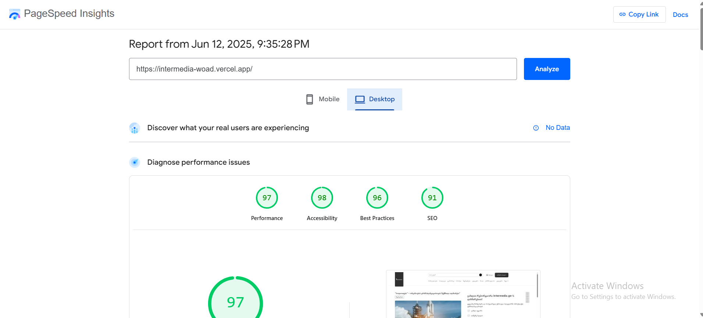

# InterMedia News Website

A modern, responsive news website built with vanilla JavaScript, HTML, and CSS. The project follows a modular architecture and uses ES modules for better code organization.

## Project Structure

```
InterMedia/
├── components/
│   ├── layout/
│   │   ├── header/
│   │   │   ├── header.html
│   │   │   ├── header.js
│   │   │   └── header.css
│   │   ├── footer/
│   │   │   ├── footer.html
│   │   │   ├── footer.js
│   │   │   └── footer.css
│   │   ├── layout.html
│   │   └── layout.js
│   └── sections/
│       ├── featuredNews/
│       ├── latestNews/
│       ├── categoryNews/
│       ├── trendingNews/
│       ├── reporterProfiles/
│       └── news/
├── pages/
│   └── home/
│       ├── home.html
│       ├── home.js
│       └── home.css
├── index.css
├── index.html
├── index.js
└── README.md
```

## Features

- **Modular Architecture**: Each component is self-contained with its own HTML, CSS, and JavaScript
- **Responsive Design**: Fully responsive layout that works on all screen sizes
- **Dynamic Content Loading**: Components are loaded dynamically using ES modules
- **Modern Navigation**: Responsive navigation with dropdown menus
- **News Sections**:
  - Featured News
  - Latest News
  - Category News
  - Trending News
  - Reporter Profiles

## Technologies Used

- HTML5
- CSS3 (with CSS Variables for theming)
- Vanilla JavaScript (ES6+)
- ES Modules
- Swiper.js for carousels

## Getting Started

1. Clone the repository:
```bash
git clone [repository-url]
```

2. Open the project in your code editor

3. Start a local server (e.g., using Live Server in VS Code)

4. Open `index.html` in your browser


## PageSpeed Insights Scores

Here are the PageSpeed Insights scores for the InterMedia website:




## Components

### Layout Components
- **Header**: Navigation bar with responsive menu
- **Footer**: Site footer with links and information

### Section Components
- **Featured News**: Main news section with prominent article display
- **Latest News**: Grid of most recent news articles
- **Category News**: News organized by topic categories
- **Trending News**: Carousel of popular/trending articles
- **Reporter Profiles**: Grid of reporter information with badges

## Card Component Structure & Class Naming

The card component uses a flexible class naming system to support different layouts and content arrangements. Modifier classes are passed as props and injected into the main card div.

### Example HTML (from card.html)
```html
<div class="global-card {{className}}">
  <div class="for__className-column">
    
    <div class="global-card__author-info">
      <span class="global-card__author-name">{{autorName}}</span>
      <span class="dot"></span>
      <span class="global-card__date">{{date}}</span>
    </div>
  </div>
  <h3 class="title__for__className-primary">{{title}}</h3>
  <div class="global-card-description">{{description}}</div>
  <div class="global-card__image">
    
  </div>
  <div class="global-card__content">
    <h3 class="global-card__title">{{title}}</h3>
    <div class="for__className-primary">{{description}}</div>
    <div class="global-card__footer">
      
      <div class="global-card__author-info">
        <span class="global-card__author-name">{{autorName}}</span>
        <span class="global-card__date">{{date}}</span>
      </div>
    </div>
  </div>
</div>
```

### Example CSS (from card.css)
```css
.global-card { ... }
.global-card__image { ... }
.global-card__content { ... }
.global-card__footer { ... }
.global-card__author-img { ... }
.global-card__author-info { ... }
.global-card__author-name { ... }
.global-card__date { ... }
.global-card-description { ... }
.for__className-column { ... }
.for__className-primary { ... }
.primary__card { ... }
.mobile__row-reverse__card { ... }
.mobile__column__card { ... }
```

### Usage in JS
```js
// Pass the layout modifier as a prop
const cardHtml = await loadCard({ ...cardData, className: "primary__card" });
const cardHtml2 = await loadCard({ ...cardData, className: "mobile__row-reverse__card" });
```

### Guidelines
- Use the `className` prop to control the card layout (e.g., `primary__card`, `mobile__row-reverse__card`, `mobile__column__card`).
- Use the `for__className-column` and `for__className-primary` classes for content that should only appear in certain layouts.
- See the `ui/card/card.html` and `ui/card/card.css` files for implementation details and more layout options.


